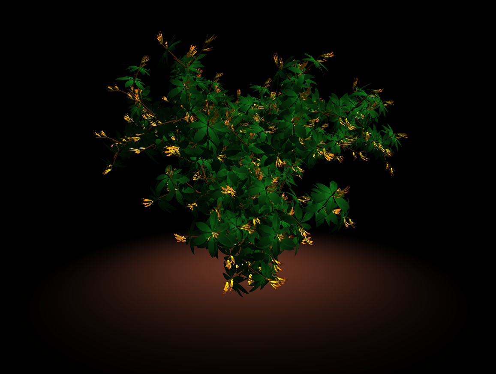
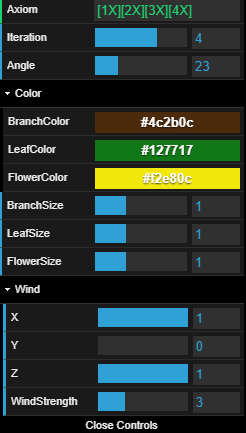

# CIS 566 Project 3: L-systems

* Univer sity of Pennsylvania
* pennkey : byumjin
* name : [Byumjin Kim](https://github.com/byumjin)

## Live Demo

* [WebGL Link](https://byumjin.github.io/Lsystem/)

## Overview

Using L-system, I have created a tree consists of branches, leaves and flowers. 

## GUI

- Axiom : The axiom.
- Iteration : Iteration counter.
- Angle : The angle of rotation of the turtle.
- Colors : The colors of each mesh the turtle draws.
- Sizes : The scale of each mesh the turtle draws.
- Wind : Wind direction and its strength.
- Due to the VBO which contains whole vertices infomation to be drawn at once, changing some of GUI values above can make lags because it may need to generate a new big VBO again.

## Rule

- F :  Move forward by line length drawing a line
- 1 :  Turn left by turning angle along X axis
- 2 :  Turn right by turning angle along X axis
- 3 :  Turn left by turning angle along Z axis
- 4 :  Turn right by turning angle along Z axis
- 5 :  Turn left by turning angle along y axis
- 6 :  Turn right by turning angle along Y axis
- [ :  Push current drawing state onto stack
- ] :  Pop current drawing state from the stack
- L :  Generate a flower
- Y :  Generate a bunch of leaves

- F -> FF (80%) or F -> F (20%)
- X -> [1FY][F11X]F[F22X]F[F33X]F[Y44X][3[Y4L[5L][6L]]]Y (90%)
  or
- X -> [1F][F11X]F[F22X]F[F33X]F[6L][F44X][3FL] (10%)
- This is because of Probability for Organic variation
- Each mesh has random scale along its random generated number generated by Math.Random()

## OBJ loading

This project uses [webgl-obj-loader](https://www.npmjs.com/package/webgl-obj-loader) to load OBJ files.

## Reference

[L-System User Notes](http://paulbourke.net/fractals/lsys/)

## Libraries

[webgl-obj-loader](https://www.npmjs.com/package/webgl-obj-loader)